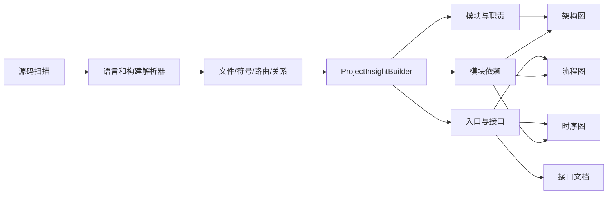

# 通用项目分析重构设计

## 目标

将“项目分析”从 FastAPI 路由展示器重构为面向项目理解的静态分析能力。第一版重点支持现有 Python/JavaScript 项目和 Java/Maven/Spring 项目，使架构图、流程图、时序图和接口文档都基于真实源码证据，并在证据不足时明确降级，而不是生成误导性的 FastAPI 占位图。

## 当前问题

- 扫描器不收集 `.java`、`pom.xml`、`.properties` 和 `.sql`，Java 项目的主体不可见。
- 路由只从 Python 装饰器提取，流程图和时序图直接依赖路由集合。
- 无路由时固定显示“未识别到 FastAPI 路由”，把框架限制暴露成项目结论。
- 架构图按文件平铺，文档和 CI 文件会淹没真正的模块结构。
- 接口文档只描述 FastAPI，无法表达 Spring MVC 路由。

## 范围

本次实现：

- 扫描 Java、XML、Properties、SQL 和 Gradle 常见文本文件。
- 解析 Java package、import、类、接口、枚举、Spring Controller 和映射注解。
- 解析 Maven 多模块和模块依赖。
- 建立运行时生成的统一 `ProjectInsight`，不新增数据库表。
- 架构图按模块和职责聚合。
- 流程图展示框架无关的“入口 -> 控制器 -> 核心模块 -> 持久化/存储”路径。
- 时序图选择代表性接口，展示有源码依据的参与者；没有接口时展示模块交互，而不是 FastAPI 占位。
- 接口文档同时支持 FastAPI 和 Spring MVC，并标注源码位置。
- 前端文案改为技术栈无关描述。

本次不实现：

- 完整编译器级 Java 调用图。
- 用户选择任意业务场景生成时序图。
- 多仓库微服务拓扑。
- 强依赖大模型的架构推断。
- Go、Rust、C# 等更多语言插件。

## 架构

### 解析层

`LocalProjectScanner` 负责安全地收集受支持文本文件。`ParserRegistry` 根据后缀分派到 Python、JavaScript、HTML、Java 或 Maven 解析器。解析结果继续写入现有项目文件、符号、路由和关系表，保持已有检索和问答兼容。

Java 解析器使用保守的静态规则：识别 package/import、类型声明、Spring 类级和方法级映射。无法确认的动态路径不伪造，只保留能够从注解读取的路径和 HTTP 方法。

### 统一洞察层

新增 `ProjectInsightBuilder`，从项目文件、路由和关系构建内存模型：

- `ProjectModule`：模块名、职责、语言、文件数量、依赖。
- `ProjectEndpoint`：方法、路径、处理器、源码位置、框架。
- `ProjectInsight`：项目类型、模块、入口点、端点和可信提示。

Maven 项目优先使用根 `pom.xml` 的 `<modules>` 和各模块 `pom.xml` 的依赖。非 Maven 项目按顶层目录聚合，并过滤 `.github`、文档、测试和生成目录等低价值节点。

### 产物层

- 架构图：模块级节点，按 UI、入口、核心、协议、持久化、存储、部署等职责分组，显示真实模块依赖。
- 流程图：有接口时从客户端进入代表性 Controller，再沿模块依赖走向核心和存储；无接口时展示模块主链路，并标注“未识别到可验证接口”。
- 时序图：选择优先级最高的代表性接口，参与者来自源码模块；没有接口时展示模块级交互并明确可信度。
- 接口文档：列出所有已识别端点、框架、处理器和源码位置；无端点时使用技术栈无关说明。

## 降级原则

- 不再输出“未识别到 FastAPI 路由”，改为“当前静态分析未识别到可验证接口”。
- 没有调用证据时不编造 Service 或 Repository 方法，只展示模块级依赖。
- 大型项目限制图中节点数量，优先模块和入口，避免文件墙。
- 生成结果始终保留源码版本，并在文案中区分“源码确认”和“结构推断”。

## kkRepo 验收目标

重新扫描后应识别：

- Java 为主要语言，文件数量显著高于当前 117。
- Maven 多模块，包括 `server`、`core`、`protocol-*`、`persistence-*`、`storage-*`、`admin-ui` 和 `browse-ui`。
- Spring Boot 入口 `KkRepoApplication`。
- Spring MVC Controller 和映射，例如 `/repository/{name}`、`/v2`、`/internal/repositories`。

生成结果应满足：

- 架构图不再平铺 `.github` 和 Markdown 文件。
- 流程图不再出现 FastAPI 占位节点。
- 时序图至少包含客户端、Spring Controller、核心模块和存储/持久化角色。
- 接口文档包含 Spring MVC 路由和源码位置。

## 测试策略

- 单元测试覆盖扫描扩展、Java/Spring 解析、Maven 模块解析和洞察聚合。
- 产物测试覆盖模块架构、框架无关降级、Spring 流程、时序和接口文档。
- 集成测试使用小型 Maven 多模块 fixture，完成扫描到四类产物的完整流程。
- 最终使用本地缓存的 `kkRepo` 做真实验收，不把远程网络作为自动测试前提。
