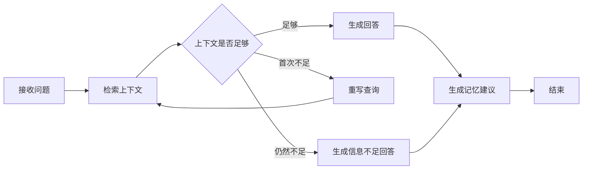

# AI 研发知识工作台项目优化对比说明

## 1. 文档目的

本文档记录项目从最初的 FastAPI + Redis + Pinecone 问答原型，逐步优化为当前“本地单人增强版研发知识工作台”的主要变化。

对比重点包括：系统架构、数据存储、LangGraph 工作流、RAG 检索、长期记忆、引用、前端交互、运行诊断和测试体系。

---

## 2. 总体变化

最初的项目更接近一个可以运行的 AI 问答 Demo：收到问题后依次读取短期记忆、长期记忆和知识库，再调用大模型生成回答。

当前项目已经变成一个具备数据管理、持久化、混合检索、可控工作流、引用追踪、运行诊断和自动化测试的本地知识工作台。

| 方面 | 最初状态 | 当前状态 |
| --- | --- | --- |
| 产品形态 | AI 问答 Demo | 本地研发知识工作台 |
| 后端架构 | Service 直接互相调用 | Domain / Application / Infrastructure / API 分层 |
| 对话流程 | 固定顺序函数调用 | LangGraph 可控工作流 |
| 对话存储 | Redis 短期历史 | SQLite 持久化会话和消息 |
| 知识存储 | 主要依赖 Pinecone | SQLite 原文 + Pinecone 向量索引 |
| 检索方式 | Pinecone/BM25 服务内混合 | SQLite FTS5 + Pinecone + RRF 融合 |
| 长期记忆 | 直接写入和召回 | 已确认记忆 + 待确认建议 + 管理页面 |
| 引用 | 只能知道是否使用 RAG | 可查看标题、片段、分类和页码 |
| 前端 | 简单深色表单页面 | 可折叠侧栏、会话历史、明暗主题、管理页面 |
| API 文档 | 默认英文 Swagger | 中文 API 概览 |
| 测试 | 缺少系统测试 | 52 个后端测试 + 8 个前端测试 |
| 运维诊断 | 主要依赖控制台报错 | 健康检查、组件状态、索引一致性检查 |

---

## 3. 后端架构优化

### 3.1 最初实现

早期 `ChatService` 直接依赖多个全局服务：

```text
ChatService
  -> ShortTermMemory（Redis）
  -> LongTermMemory
  -> RAGService
  -> LLMService
```

这种方式容易实现，但存在以下问题：

- 业务逻辑和第三方服务耦合较紧。
- 全局单例较多，单元测试不方便。
- Pinecone、Redis 或大模型故障容易直接影响整条调用链。
- 数据对象没有统一的状态和生命周期。
- API、业务逻辑和基础设施边界不清楚。

### 3.2 当前实现

当前代码按职责划分为：

```text
API 层
  -> Application 用例层
      -> Domain 实体和接口
          -> Infrastructure 基础设施实现
              -> SQLite / Pinecone / DashScope / FTS5
```

主要目录：

- `backend/app/api`：HTTP 接口、请求模型和错误响应。
- `backend/app/application`：对话、文档、记忆和迁移用例。
- `backend/app/domain`：实体、状态、错误和端口定义。
- `backend/app/infrastructure`：数据库、模型、向量库、文档解析和检索实现。
- `backend/app/workflows`：LangGraph 状态和节点。
- `backend/app/dependencies.py`：依赖容器和组件装配。

优化收益：

- 可以使用 Fake Model、Fake Embedding 和 Fake Vector Index 做离线测试。
- 更换模型或向量库时，不需要重写全部业务代码。
- 文档、记忆和会话拥有独立的应用用例。
- 第三方服务错误可以转换成统一的领域错误。

---

## 4. LangGraph 工作流优化

### 4.1 最初状态

原来的聊天流程是固定的同步调用：

```text
读取短期记忆
-> 读取长期记忆
-> 检索知识库
-> 调用模型
-> 保存对话
```

流程是否继续、是否重写问题、资料不足时如何处理，都缺少明确状态。

### 4.2 当前状态

现在使用 LangGraph 构建聊天工作流：



已经实现：

- 对知识库和长期记忆分别检索。
- 资料为空时允许一次查询重写。
- 信息仍不足时走独立回答节点。
- 用户偏好问题优先使用长期记忆。
- 回答完成后可以产生待确认记忆建议。
- 工作流状态由 `ChatGraphState` 统一传递。

相比最初版本，聊天流程从“写死的调用顺序”变成了“可观察、可扩展的状态机”。

---

## 5. 数据存储优化

### 5.1 最初状态

- Redis 用于短期会话历史。
- Pinecone 同时承担向量检索和部分数据保存职责。
- 本地缺少统一的数据源。
- Pinecone 写入失败后，难以判断哪些内容已经真正入库。
- 不方便查看全部会话、知识和长期记忆。

### 5.2 当前状态

新增 SQLite 数据库：

```text
backend/data/app.db
```

SQLite 现在是主要数据源，保存：

- `conversations`：对话信息。
- `messages`：用户和助手消息、引用、错误与警告。
- `documents`：知识文档及其索引状态。
- `memories`：已确认长期记忆。
- `memory_candidates`：待确认、已确认和已拒绝建议。
- `chunks`：知识和记忆的文本分块及向量 ID。
- `chunks_fts`：FTS5 全文检索索引。
- `migration_records`：Pinecone 数据迁移记录。

Pinecone 的职责被收敛为：

- 保存文本对应的语义向量。
- 在 `rag` namespace 中检索知识库。
- 在 `ltm` namespace 中检索长期记忆。

现在形成了更清晰的职责分工：

```text
SQLite：保存原始数据和业务状态
Pinecone：保存向量并执行语义检索
DashScope Embedding：生成文本向量
DashScope Qwen：生成最终回答
```

---

## 6. RAG 检索优化

### 6.1 最初状态

- 检索逻辑集中在旧版 `RAGService` 和 `PineconeStore` 中。
- 查询改写、BM25 和向量检索耦合在服务内部。
- 检索结果主要被拼接为一段字符串。
- 缺少统一的结果对象和降级警告。

### 6.2 当前状态

当前检索流程：

```text
用户问题
  -> SQLite FTS5 关键词检索
  -> DashScope 生成查询向量
  -> Pinecone 语义检索
  -> Reciprocal Rank Fusion 融合排序
  -> 生成 ScoredChunk 列表
```

主要优化：

- 关键词检索和语义检索可以独立运行。
- Pinecone 暂时不可用时，允许退化为 FTS5 检索。
- 检索降级会返回 `semantic_retrieval_unavailable` 警告。
- 知识和记忆使用不同 namespace，避免数据混用。
- 个人偏好类问题会优先排列长期记忆。
- 检索结果保留文档 ID、记忆 ID、标题、分类、页码和向量 ID。

---

## 7. 长期记忆优化

### 7.1 最初状态

- 记忆主要通过 Pinecone 写入和召回。
- 缺少完整的查看、编辑、删除和确认流程。
- 系统可能直接把对话内容当作长期记忆。
- 写入失败时可能出现“本地存在但向量不存在”。

### 7.2 当前状态

现在区分两类数据：

1. 已确认记忆：会参与后续回答。
2. 待确认建议：只有用户确认后才会成为长期记忆。

已经支持：

- 文本和 PDF 记忆录入。
- 偏好、事实、决策、背景等记忆类型。
- 记忆编辑、删除和重新索引。
- 候选记忆确认与拒绝。
- 拒绝后立即从待确认页面消失。
- 重复录入时验证 Pinecone 向量是否真实存在。
- 默认中文标题，清理历史问号乱码记录。

---

## 8. 知识库管理优化

知识文档现在拥有完整生命周期：

```text
pending -> indexing -> indexed
                    -> failed
indexed/failed -> deleting
```

已经支持：

- 文本知识录入。
- PDF 上传、页数和文件大小限制。
- 文档分块和 token 数记录。
- 标题、分类、来源和内容哈希保存。
- 文档详情和分块查看。
- 失败状态和错误信息展示。
- 手动重建索引。
- 文档和 Pinecone 向量同步删除。

---

## 9. 引用与可追溯性优化

最初接口主要返回：

```json
{
  "rag_used": true,
  "ltm_used": false
}
```

这只能说明是否使用了资料，不能说明具体使用了什么。

当前回答会保存和返回：

- 引用片段 ID。
- 文档或记忆标题。
- 原文摘要。
- 分类。
- PDF 页码。

前端点击引用按钮后，可以在详情抽屉中查看原始片段，从而降低模型回答无法核对的问题。

---

## 10. 稳定性和错误处理优化

优化过程中已经修复的典型问题：

- Pinecone 不接受 `page_number: null` 导致 `vector upsert failed`。
- SQLite 已保存但 Pinecone 写入失败导致的索引不一致。
- 重复记忆直接返回本地记录，却没有验证远程向量。
- LangChain Embedding 自动分词导致 DashScope Embedding 调用异常。
- 旧会话 ID 不存在时导致聊天接口 404。
- 知识库结果排在记忆前面，导致个人偏好被截断。
- 前端新 HTML 和旧 CSS 缓存混用。
- 输入框在视口底部被遮挡。
- 点击最近对话时没有优先切回对话页面。
- 中文 API 页面继承 `overflow: hidden` 后无法滚动。

同时增加了统一异常处理和健康检查，减少只能依靠控制台堆栈排错的情况。

---

## 11. 运行诊断和数据一致性优化

新增接口：

- `/api/health/live`：检查进程存活。
- `/api/health/ready`：检查 SQLite、Pinecone 和 DashScope 配置。
- `/api/diagnostics`：查看组件、数据量和一致性。

新增脚本：

```powershell
.\backend\.venv\Scripts\python.exe .\scripts\check_index_consistency.py
```

该脚本会比较 SQLite 中的向量 ID 和 Pinecone 中的向量 ID，检查：

- 本地存在但 Pinecone 缺失的向量。
- Pinecone 存在但本地缺失的孤立向量。
- `rag` 和 `ltm` namespace 的向量数量。

同时提供了 `migrate_pinecone_to_sqlite.py`，用于将旧 Pinecone 数据迁移到 SQLite 管理体系。

---

## 12. 前端体验优化

### 最初前端

- 简单深色页面。
- 对话、记忆和知识录入以表单为主。
- 缺少完整的数据列表和管理操作。
- 会话历史不方便管理。
- 无侧栏折叠、主题切换和移动端适配。

### 当前前端

- 类现代 AI 应用的单列对话界面。
- 用户消息和助手回答使用不同布局。
- 输入框固定在安全区域，不被窗口底部遮挡。
- 功能和会话历史集中在可折叠侧栏。
- 会话历史独立滚动。
- 会话支持自动命名、手动重命名和删除。
- 点击最近对话会优先切回对话页面。
- 支持浅色和深色主题并持久化选择。
- 支持桌面和移动端布局。
- 提供知识库、个人记忆和运行状态管理页面。
- 提供中文 API 文档页面。
- 使用资源版本号避免浏览器加载旧 CSS/JavaScript。

---

## 13. 测试体系优化

当前测试包括：

### 后端测试

```powershell
cd backend
.\.venv\Scripts\python.exe -m pytest -q
```

当前共有 52 个测试，覆盖：

- 领域实体和状态转换。
- 领域错误。
- 接口契约。
- Embedding 参数。
- Pinecone metadata 清洗。
- LangGraph 记忆优先级。
- 健康检查和聊天持久化。
- 旧会话兼容。
- 自动会话命名。
- 文档和记忆管理流程。
- 重复记忆远程索引修复。
- 中文 API 页面。

### 前端测试

```powershell
cd frontend
node --test *.test.mjs js\api.test.mjs
```

当前共有 8 个测试，覆盖：

- API 请求和 SSE 解析。
- 静态资源缓存版本。
- 侧栏结构。
- 明暗主题和输入区布局。
- 记忆候选过滤。
- 最近对话优先切换。
- API 文档滚动。

此外，使用 Playwright 和真实 Chrome 验证了桌面端、移动端、侧栏折叠、主题持久化和鼠标滚动。

---

## 14. 配置和启动优化

当前配置集中在 `backend/.env`，并提供 `backend/.env.example`。

主要配置包括：

- DashScope API Key、模型和 Embedding 模型。
- Pinecone API Key、索引、Host 和 namespace。
- SQLite 数据库地址。
- RAG Top K、分块大小和重叠长度。
- PDF 文件大小和页数限制。

依赖版本写入 `requirements.txt` 和 `requirements-dev.txt`，项目统一使用 Python 3.11 虚拟环境。

启动方式简化为：

```powershell
cd E:\桌面\AI赋能平台
.\start.bat
```

---

## 15. 当前仍存在的技术债

虽然主流程已经完成重构，但仍有以下可继续优化的部分：

1. `backend/app/services` 和部分旧 API 文件仍然保留，容易让开发者误认为它们仍是主流程。确认不再需要兼容后，可以删除或移动到 `legacy` 目录。
2. 当前 `/api/chat/stream` 是先完成完整回答，再按片段发送，并不是真正的模型 token 实时流式输出。
3. 当前 LangGraph 工作流较轻量，还可以增加查询分类、相关性评分、答案验证和引用校验节点。
4. FTS5 对中文分词能力有限，中文关键词召回仍主要依赖向量检索。
5. 外部 DashScope/Pinecone 的自动化测试默认关闭，当前主要依靠健康检查和手动端到端测试。
6. 文档入库仍在请求线程中执行，大型 PDF 可以进一步改为后台任务。
7. 项目按“本地单人版”设计，没有登录、用户隔离和权限控制。
8. 当前没有正式 Git 仓库和持续集成流水线，版本追踪和发布管理还可以完善。

---

## 16. 总结

本轮优化并不是只把原有代码替换成 LangChain 或 LangGraph，而是完成了以下整体升级：

```text
问答 Demo
-> 有本地数据源的知识工作台
-> 有可控状态的 LangGraph 工作流
-> 有混合检索和引用的 RAG 系统
-> 有确认机制的长期记忆系统
-> 有管理页面、诊断和测试的可维护应用
```

当前项目已经适合本地个人使用、功能验证和后续继续开发。与最初版本相比，最明显的提升是：数据可查看、流程可控制、回答可核对、故障可诊断、功能可测试、界面可长期使用。
