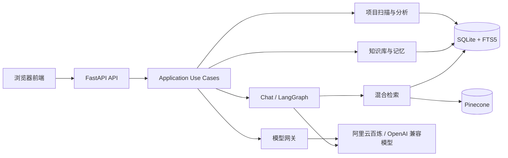
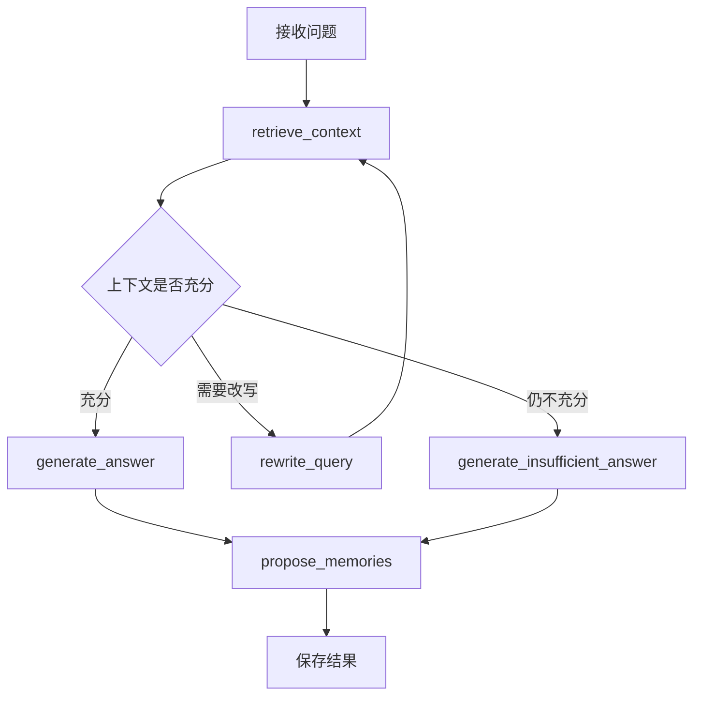

# AI 研发赋能平台研发文档

> 文档版本：v2.0
>
> 最后更新：2026-07-20
>
> 适用范围：当前 `main` 分支的模块化单体版本

## 1. 项目定位

AI 研发赋能平台是一个面向个人开发者和小型研发团队的本地 AI 工作台。它把通用问答、项目源码分析、知识库、长期记忆、模型管理和模型对比整合在一个免登录的 Web 应用中。

当前版本重点解决以下问题：

- 将本地目录、GitHub 或 Gitee 公开仓库连接为可问答项目。
- 静态扫描项目文件、符号、接口和依赖关系，快速了解项目结构。
- 生成架构图、流程图、时序图和规范化接口文档。
- 使用 SQLite FTS5 与 Pinecone 进行混合检索，为问答提供可引用上下文。
- 管理个人长期记忆，并通过待确认建议避免模型自动写入错误记忆。
- 配置多个 OpenAI 兼容模型，支持流式回答和双模型并行对比。

当前产品形态仍然是“本地单人增强版”：没有登录、组织、角色和数据权限隔离。多人访问同一服务时会共享全部项目、对话、知识库和记忆。

## 2. 当前功能

### 2.1 智能问答

- 新建、重命名和删除对话。
- 对话按所属项目折叠分组，通用对话单独展示。
- 第一个问题自动生成对话标题。
- 普通问答支持 SSE 流式输出。
- 项目对话优先检索当前项目源码；通用对话检索知识库和个人记忆。
- 回答展示知识或源码引用，可查看引用详情和源码行号。
- 回答失败时保留问题并支持重试。

### 2.2 知识库

- 录入文本和 PDF 文档。
- 支持标题、分类、状态筛选、搜索、修改、删除和重新索引。
- 文档分块及元数据保存在 SQLite。
- 关键词检索使用 SQLite FTS5。
- 语义向量保存在 Pinecone 的知识库命名空间。
- Pinecone 不可用时保留本地全文检索能力，并返回降级警告。

### 2.3 个人记忆

- 手动录入、编辑、删除和查询长期记忆。
- 已确认记忆才会参与后续问答。
- 流式对话中出现“我偏好”“我喜欢”“请记住”“我的决定”等表达时，会生成待确认建议。
- 建议可确认、修改后确认或拒绝；拒绝后不再参与问答。
- 记忆文本和分块元数据保存在 SQLite，语义向量保存在 Pinecone 的记忆命名空间。

### 2.4 项目连接与扫描

支持三类项目源：

| 类型 | 输入 | 当前限制 |
|---|---|---|
| 本地目录 | 本机绝对路径 | 只读扫描，不修改源项目 |
| GitHub | 公开仓库 HTTPS 地址 | 不支持私有仓库和 SSH 地址 |
| Gitee | 公开仓库 HTTPS 地址 | 不支持私有仓库和 SSH 地址 |

远程项目会浅克隆到 `backend/data/git-projects/`。GitHub 克隆使用 HTTP/1.1、稀疏检出和重试机制，降低网络不稳定及大仓库下载带来的影响。

扫描器会：

- 忽略 `.git`、虚拟环境、`node_modules`、构建产物和缓存目录。
- 忽略 `.env` 文件、二进制文件、符号链接和超过 1 MB 的单个文件。
- 对 YAML、TOML、Properties 中疑似密码、Token、API Key 的配置值进行脱敏。
- 读取 Python、JavaScript、HTML、CSS、Java、XML、Markdown、JSON、YAML、TOML、SQL、Gradle 等文本文件。
- 将项目文件内容、符号、接口、模块关系和源码分块保存到 SQLite。
- 尝试写入项目专属 Pinecone 命名空间；失败时仍可使用 SQLite FTS5 进行项目问答。

### 2.5 项目分析产物

项目扫描完成后可以生成：

- **架构图**：按模块职责、语言和依赖关系生成 Mermaid 图。
- **流程图**：优先选取代表性接口，展示调用方、入口、处理器和关联模块；没有接口时展示模块主链路。
- **时序图**：展示代表性请求场景中的参与者和调用顺序；没有接口时展示模块级交互。
- **接口文档**：只分析 GET、POST、PUT、DELETE，输出接口名称、请求路径、请求方式、请求参数、请求样例、请求体和响应数据格式。

当前静态分析能力包括：

- Python AST：导入、类、函数、调用和路由装饰器。
- Java：包、导入、类型、方法、Spring MVC Mapping 和方法调用。
- Maven：模块与依赖。
- JavaScript：ES Module/CommonJS 导入和函数。
- HTML：脚本和样式引用。

生成结果来自静态分析，不会执行被分析项目，因此动态路由、运行时依赖注入、反射和复杂框架配置可能无法完全识别。

### 2.6 模型管理与对比

- 默认支持阿里云百炼 OpenAI 兼容接口。
- 可以添加、编辑、删除和设置默认模型。
- 支持其他 OpenAI 兼容供应商，只需配置名称、Base URL、模型名和 API Key。
- API Key 不明文写入 SQLite，而是使用 Fernet 加密后保存到本地数据目录。
- 模型对比最多选择两个模型，并行调用后在同一对话时间线中展示模型名称、回答和耗时。

### 2.7 运行状态

运行状态页面提供：

- FastAPI 进程存活检查。
- SQLite、Pinecone 和阿里云百炼就绪状态。
- 对话、文档、记忆和分块数量。
- Pinecone 索引名称、向量维度和命名空间数量。
- SQLite 与 Pinecone 向量一致性检查。
- 数据迁移状态。

诊断 Pinecone 时使用短超时，外部网络异常不会长期阻塞本地服务。

## 3. 系统架构

当前实现采用模块化单体：一个 FastAPI 进程同时提供 API 和静态前端，业务模块在同一代码库内通过领域端口和依赖容器组合。



### 3.1 分层职责

| 层 | 目录 | 职责 |
|---|---|---|
| API | `backend/app/api/` | HTTP 路由、请求校验、序列化和错误转换 |
| Application | `backend/app/application/` | 聊天、文档、记忆、项目、产物和模型用例 |
| Domain | `backend/app/domain/` | 实体、枚举、端口和领域异常 |
| Workflows | `backend/app/workflows/` | LangGraph 状态、节点和路由 |
| Infrastructure | `backend/app/infrastructure/` | SQLite、Pinecone、模型、检索、Git、扫描器和密钥存储 |
| Composition | `backend/app/dependencies.py` | 创建数据库、仓储、模型、检索器和用例 |
| Frontend | `frontend/` | 无构建步骤的 HTML、CSS、ES Modules 单页应用 |

### 3.2 当前入口

生效入口是 `backend/app/main.py` 中的 `app = create_app()`。

当前主应用挂载：

- `chat_v2`
- `documents_v2`
- `memories_v2`
- `diagnostics`
- `projects`
- `artifacts`
- `model_providers`

`backend/app/api/chat.py`、`knowledge.py`、`memory.py` 以及部分 `backend/app/services/` 文件属于早期实现遗留，不在当前 `main.py` 主路由中使用。旧文件仍应谨慎保留，后续可在确认无兼容需求后清理。

## 4. 问答与检索流程

### 4.1 LangGraph 非流式流程

`POST /api/chat` 使用 LangGraph：



### 4.2 流式流程

`POST /api/chat/stream` 由 `ChatUseCase` 进行流式编排：

1. 创建或读取会话，并保存用户消息和待生成的助手消息。
2. 根据会话绑定的项目决定检索范围。
3. 项目会话检索项目源码；通用会话并行检索知识库和个人记忆。
4. 将检索上下文拼入提示词。
5. 通过默认模型或指定模型持续输出 Token。
6. 保存完整回答、引用、警告和失败状态。
7. 满足记忆触发词时创建待确认建议。

SSE 事件包括 `session`、`stage`、`token`、`citations`、`warning`、`error` 和 `done`。

### 4.3 混合检索

知识库和记忆采用两路召回：

- SQLite FTS5：关键词和全文匹配。
- Pinecone：基于阿里云 `text-embedding-v4` 的语义相似度检索。

`HybridRetriever` 对两路结果执行 Reciprocal Rank Fusion，并去重、排序后返回引用。某一路不可用时保留另一路结果并附带警告。

项目问答使用项目专属 FTS5 表和项目专属 Pinecone 命名空间，避免不同项目的源码结果混在一起。

## 5. 数据存储

### 5.1 SQLite

默认数据库：

```text
backend/data/app.db
```

主要数据表：

| 数据 | 表 |
|---|---|
| 对话与消息 | `conversations`, `messages` |
| 知识文档 | `documents`, `chunks`, `chunks_fts` |
| 长期记忆 | `memories`, `memory_candidates` |
| 项目 | `projects`, `project_files`, `project_symbols`, `project_routes` |
| 项目检索 | `project_chunks`, `project_chunks_fts` |
| 项目关系和产物 | `project_relations`, `analysis_artifacts` |
| 模型配置 | `model_providers` |
| 迁移和任务 | `migration_records`, `ingestion_jobs` |

SQLite 使用 WAL 模式时还会生成 `app.db-wal` 和 `app.db-shm`。

### 5.2 Pinecone

| 命名空间 | 默认值 | 用途 |
|---|---|---|
| 知识库 | `rag` | 文档语义向量 |
| 个人记忆 | `ltm` | 长期记忆语义向量 |
| 项目 | 按项目 ID 生成 | 项目源码语义向量 |

Pinecone 索引维度必须与 `EMBEDDING_DIMENSION` 一致，默认是 1024。

### 5.3 本地密钥与远程仓库缓存

```text
backend/data/.model-secrets.key
backend/data/model-secrets.json
backend/data/git-projects/
```

`.env`、`.venv/` 和整个 `backend/data/` 都在 `.gitignore` 中，不会提交到 GitHub。

## 6. 配置

复制环境变量模板：

```powershell
Copy-Item backend\.env.example backend\.env
```

主要配置：

```ini
# 阿里云百炼
DASHSCOPE_API_KEY=your_dashscope_api_key
DASHSCOPE_BASE_URL=https://dashscope.aliyuncs.com/compatible-mode/v1
LLM_MODEL=qwen-plus
EMBEDDING_MODEL=text-embedding-v4
EMBEDDING_DIMENSION=1024

# Pinecone
PINECONE_API_KEY=your_pinecone_api_key
PINECONE_INDEX_NAME=your_index_name
PINECONE_HOST=your-index-host.pinecone.io
PINECONE_RAG_NAMESPACE=rag
PINECONE_MEMORY_NAMESPACE=ltm

# SQLite
DATABASE_URL=sqlite:///data/app.db

# 检索与文档
RAG_TOP_K=5
RAG_CHUNK_SIZE=500
RAG_CHUNK_OVERLAP=50
UPLOAD_MAX_BYTES=20971520
PDF_MAX_PAGES=300

# 远程仓库
GIT_CACHE_DIR=data/git-projects
GIT_CLONE_TIMEOUT_SECONDS=180
GIT_UPDATE_TIMEOUT_SECONDS=90

# 诊断
DIAGNOSTICS_TIMEOUT_SECONDS=3
```

当前版本主流程不依赖 Redis。运行文档中如果仍出现 Redis 安装要求，应视为旧版说明。

## 7. 目录结构

```text
AI赋能平台/
├─ backend/
│  ├─ app/
│  │  ├─ api/                  # FastAPI 路由
│  │  ├─ application/          # 用例编排
│  │  ├─ domain/               # 领域实体、端口、异常
│  │  ├─ infrastructure/       # 数据库、检索、模型、项目分析
│  │  ├─ workflows/            # LangGraph 工作流
│  │  ├─ config.py             # 环境配置
│  │  ├─ dependencies.py       # 依赖容器
│  │  └─ main.py               # 应用入口
│  ├─ data/                    # 本地数据库、密钥和仓库缓存，不进 Git
│  ├─ tests/                   # 后端测试
│  ├─ .env.example             # 环境变量模板
│  ├─ requirements.txt         # 运行依赖
│  └─ requirements-dev.txt     # 测试依赖
├─ frontend/
│  ├─ css/style.css
│  ├─ js/                      # ES Modules
│  ├─ index.html
│  └─ *.test.mjs               # 前端 Node 测试
├─ docs/                       # 设计、规划和阶段文档
├─ scripts/                    # 辅助脚本
├─ start.bat                   # Windows 启动脚本
├─ .gitignore
└─ 研发文档.md
```

## 8. 环境与依赖

### 8.1 运行环境

- Python 3.11，项目启动脚本按该版本和虚拟环境布局维护。
- `start.bat` 面向 Windows 10/11；后端也可在 Linux/macOS 使用等价 Uvicorn 命令运行。
- Git，用于连接 GitHub/Gitee 项目。
- 可访问阿里云百炼、Pinecone、GitHub 或 Gitee 的网络。
- 运行应用不需要 Node.js；只有执行前端测试时需要 Node.js。

### 8.2 核心 Python 依赖

- FastAPI、Uvicorn
- LangChain、LangGraph、LangChain OpenAI
- SQLAlchemy、aiosqlite、langgraph-checkpoint-sqlite
- Pinecone、langchain-pinecone
- pypdf、python-multipart
- pydantic、pydantic-settings
- httpx、cryptography、tiktoken

精确版本以 `backend/requirements.txt` 为准。测试依赖以 `backend/requirements-dev.txt` 为准。

## 9. 安装与启动

### 9.1 首次安装

```powershell
git clone https://github.com/codeWenWang/ai-rd-workbench.git
cd ai-rd-workbench\backend

py -3.11 -m venv .venv
.\.venv\Scripts\python.exe -m pip install --upgrade pip
.\.venv\Scripts\python.exe -m pip install -r requirements.txt

Copy-Item .env.example .env
```

编辑 `backend/.env`，填入模型和 Pinecone 配置。

### 9.2 启动

在项目根目录执行：

```powershell
.\start.bat
```

等价命令：

```powershell
cd backend
.\.venv\Scripts\python.exe -m uvicorn app.main:app --host 127.0.0.1 --port 8000 --reload
```

访问地址：

| 地址 | 用途 |
|---|---|
| `http://127.0.0.1:8000/` | Web 工作台 |
| `http://127.0.0.1:8000/api/health` | 基础健康检查 |
| `http://127.0.0.1:8000/api/health/ready` | 依赖就绪检查 |
| `http://127.0.0.1:8000/api/diagnostics` | 完整诊断数据 |

当前版本主动关闭 FastAPI Swagger 和 ReDoc 页面，`/docs` 返回 404。

### 9.3 更换端口

端口冲突或 Windows 报 `WinError 10013` 时：

```powershell
cd backend
.\.venv\Scripts\python.exe -m uvicorn app.main:app --host 127.0.0.1 --port 8010 --reload
```

## 10. 测试

### 10.1 后端测试

```powershell
cd backend
.\.venv\Scripts\python.exe -m pip install -r requirements-dev.txt
.\.venv\Scripts\python.exe -m pytest
```

测试覆盖 API、仓储、LangGraph、检索降级、项目扫描、GitHub/Gitee、产物生成、接口文档、模型管理、诊断和迁移一致性。

### 10.2 前端测试

```powershell
cd frontend
node --test
```

前端测试覆盖 API 契约、资源版本、侧边栏、主题、对话历史分组、模型对比、项目分析、记忆交互和响应式布局约束。

### 10.3 浏览器冒烟测试

服务启动后执行：

```powershell
cd frontend
node e2e-smoke.cjs
```

首次执行需要安装 Node.js Playwright 及 Chromium：

```powershell
npm install --no-save playwright
npx playwright install chromium
node e2e-smoke.cjs
```

冒烟测试会连接示例项目、执行扫描、生成分析产物，并验证桌面端和移动端关键布局。

## 11. 主要 API

### 11.1 对话

| 方法 | 路径 | 说明 |
|---|---|---|
| POST | `/api/chat/session` | 创建对话 |
| POST | `/api/chat` | 非流式 LangGraph 问答 |
| POST | `/api/chat/stream` | SSE 流式问答 |
| GET | `/api/conversations` | 查询对话列表 |
| GET | `/api/conversations/{id}/messages` | 查询对话消息 |
| PATCH | `/api/conversations/{id}` | 重命名对话 |
| DELETE | `/api/conversations/{id}` | 删除对话和消息 |

### 11.2 知识库和记忆

| 方法 | 路径 | 说明 |
|---|---|---|
| GET | `/api/documents` | 查询知识文档 |
| POST | `/api/documents/text` | 录入文本知识 |
| POST | `/api/documents/pdf` | 上传 PDF 知识 |
| PATCH/DELETE | `/api/documents/{id}` | 修改或删除知识 |
| POST | `/api/documents/{id}/reindex` | 重新索引知识 |
| GET | `/api/memories` | 查询已确认记忆 |
| POST | `/api/memories` | 录入记忆 |
| PATCH/DELETE | `/api/memories/{id}` | 修改或删除记忆 |
| GET | `/api/memory-candidates` | 查询待确认建议 |
| POST | `/api/memory-candidates/{id}/confirm` | 确认建议 |
| POST | `/api/memory-candidates/{id}/reject` | 拒绝建议 |

### 11.3 项目和产物

| 方法 | 路径 | 说明 |
|---|---|---|
| GET | `/api/projects` | 查询项目 |
| POST | `/api/projects` | 连接本地、GitHub 或 Gitee 项目 |
| POST | `/api/projects/{id}/scan` | 更新远程缓存并扫描项目 |
| GET | `/api/projects/{id}/files` | 查询项目文件 |
| GET | `/api/projects/{id}/routes` | 查询项目接口 |
| DELETE | `/api/projects/{id}` | 删除项目和本地缓存 |
| GET | `/api/projects/{id}/artifacts` | 查询分析产物 |
| POST | `/api/projects/{id}/artifacts/{type}` | 生成分析产物 |

`type` 支持 `architecture`、`flow`、`sequence` 和 `api_docs`。

### 11.4 模型和诊断

| 方法 | 路径 | 说明 |
|---|---|---|
| GET | `/api/model-providers` | 查询模型配置 |
| POST | `/api/model-providers` | 添加模型配置 |
| PATCH/DELETE | `/api/model-providers/{id}` | 修改或删除模型配置 |
| POST | `/api/models/compare` | 并行比较最多两个模型 |
| GET | `/api/health/live` | 存活检查 |
| GET | `/api/health/ready` | 依赖就绪检查 |
| GET | `/api/diagnostics` | 运行状态和一致性检查 |

## 12. Git 与数据安全

以下内容不能提交到 Git：

- `backend/.env`
- `.venv/`、`backend/.venv/`
- `backend/data/`
- 上传文件、日志和测试截图

更换 API Key 时只修改本机 `backend/.env` 或模型设置页面。不要把真实 Key 写入文档、测试、提交信息或截图。

远程项目扫描虽然只读，但源码会复制到本地 SQLite 供全文检索。处理公司私有源码前，应确认本机磁盘权限、备份策略和数据清理要求。

## 13. 团队协作边界

当前默认模式：

- 每个成员独立克隆代码。
- 每个成员拥有自己的 `.env`、SQLite 数据库和本地模型密钥。
- Git 只同步代码和文档，不同步对话、知识库、记忆和项目缓存。

如果多人访问同一台服务：

- 所有人会看到同一套对话、项目、知识库和记忆。
- 当前没有身份认证和权限控制，任何访问者都能修改或删除共享数据。
- 仅适合可信内网中的演示或小团队试用，不应直接暴露到公网。

要升级为正式团队版，需要增加：

- 用户、组织、工作区和成员关系。
- 登录认证、角色权限和操作审计。
- 对话、项目、知识库、记忆和模型配置的 `workspace_id`/`owner_id` 隔离。
- PostgreSQL 等集中式数据库。
- Pinecone 按工作区命名空间或元数据过滤。
- 服务端密钥管理、备份、恢复和部署流程。

## 14. 已知限制与后续方向

- 只支持公开 GitHub/Gitee HTTPS 仓库，不支持私有仓库授权。
- 静态分析不会执行项目，无法完整还原动态调用链。
- Python 项目接口分析偏向装饰器模式，Java 项目偏向 Spring MVC。
- JavaScript 目前主要分析模块引用，尚未完整识别 Express/NestJS 路由和调用图。
- SQLite 适合本地单机，不适合高并发多人写入。
- 当前没有用户和团队权限隔离。
- Pinecone、模型服务或网络异常时会降级或返回警告，语义检索和回答质量会受影响。
- 部分早期 API 和 Service 文件仍保留在代码库中，后续可在完成兼容性核对后清理。

建议后续优化优先级：

1. 团队工作区、用户认证和数据权限。
2. 私有 GitHub/Gitee 仓库连接与凭据管理。
3. 扩展 JavaScript、Spring、Python 项目的语义分析和调用图。
4. PostgreSQL、任务队列和后台索引任务。
5. 项目增量扫描、差异分析和版本对比。
6. 评测集、检索指标、模型对比指标和可观测性。
